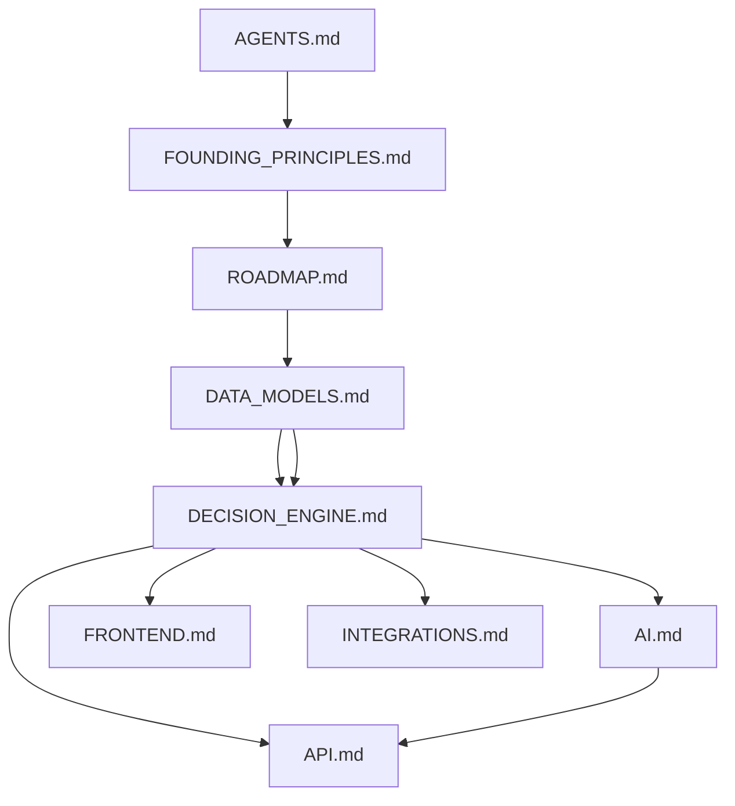

# Chef — Documentation Index

**When to read this:** Start here for orientation, the full table of contents, and a suggested reading order before implementing or changing Chef.

Chef is an AI-powered kitchen decision intelligence system. These docs split product, architecture, and implementation guidance into topic-scoped files.

---

## Table of contents

| Doc | Purpose |
|-----|---------|
| [AGENTS.md](./AGENTS.md) | Agent entry point: product identity, priorities, dev principles, AI boundaries, UX |
| [FOUNDING_PRINCIPLES.md](./FOUNDING_PRINCIPLES.md) | Moat, anti-goals, product advice |
| [ROADMAP.md](./ROADMAP.md) | Phase 1–3 features and current completion status |
| [DATA_MODELS.md](./DATA_MODELS.md) | Ingredient, Recipe, CookingHistory, GroceryItem, DiscardedIngredient schemas; **timezone contract** (naive IST on API, UTC in DB) |
| [DECISION_ENGINE.md](./DECISION_ENGINE.md) | Cook vs order vs eat-out; deterministic scoring formulas |
| [AI.md](./AI.md) | Provider (Groq), NL queries, normalization, vision parsing, AI limits |
| [API.md](./API.md) | REST endpoints |
| [FRONTEND.md](./FRONTEND.md) | All screens: Dashboard, Inventory, Decision, Recipe, Health, Chat, History, Settings |
| [INTEGRATIONS.md](./INTEGRATIONS.md) | Recipe APIs (TheMealDB live), Swiggy/Zomato stub, compare logic |

---

## Suggested reading order

**Fast paths**

- **New agent / first session:** `AGENTS.md` → `FOUNDING_PRINCIPLES.md` → `DECISION_ENGINE.md` → `DATA_MODELS.md`
- **Backend API work:** `DATA_MODELS.md` → `API.md` → `DECISION_ENGINE.md`
- **AI / LLM work:** `AI.md` → `DECISION_ENGINE.md` → `DATA_MODELS.md` (do not put counts/expiry/scheduling in the LLM)
- **Frontend:** `FRONTEND.md` → `API.md` → `DECISION_ENGINE.md`
- **Delivery / restaurant comparison:** `INTEGRATIONS.md` → `DECISION_ENGINE.md` → `DATA_MODELS.md`

---

## Product one-liner

Chef is not just a recipe app or pantry tracker. It is a **kitchen decision intelligence system** that helps users manage inventory, reduce waste, and decide between cooking, ordering, and eating out—optimized for cost, effort, health, and convenience.

---

## Implementation notes for agents

- Prefer cross-links (e.g. schemas in `DATA_MODELS.md`) over copying JSON into multiple files.
- Read `AGENTS.md` and `FOUNDING_PRINCIPLES.md` before proposing features; respect anti-goals and the decision-engine moat.
- Implement deterministic logic per `DECISION_ENGINE.md` and `AI.md`; do not expand scope into full Swiggy/Zomato integrations.
- Follow `ROADMAP.md` phase boundaries unless the user explicitly reprioritizes.
- All API datetimes are naive IST on the wire; see [DATA_MODELS.md — Timezones](./DATA_MODELS.md#timezones) before touching history, energy, or datetime inputs.
- **Schema changes:** register each additive migration as a new named entry in `MIGRATIONS` (`backend/app/database.py`); see [CLAUDE.md](../CLAUDE.md) — Database migrations.
