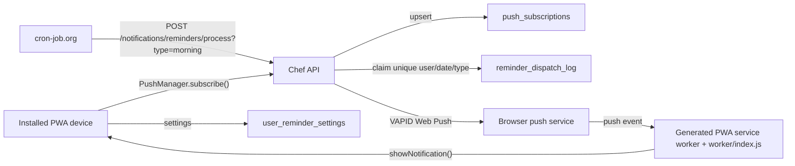
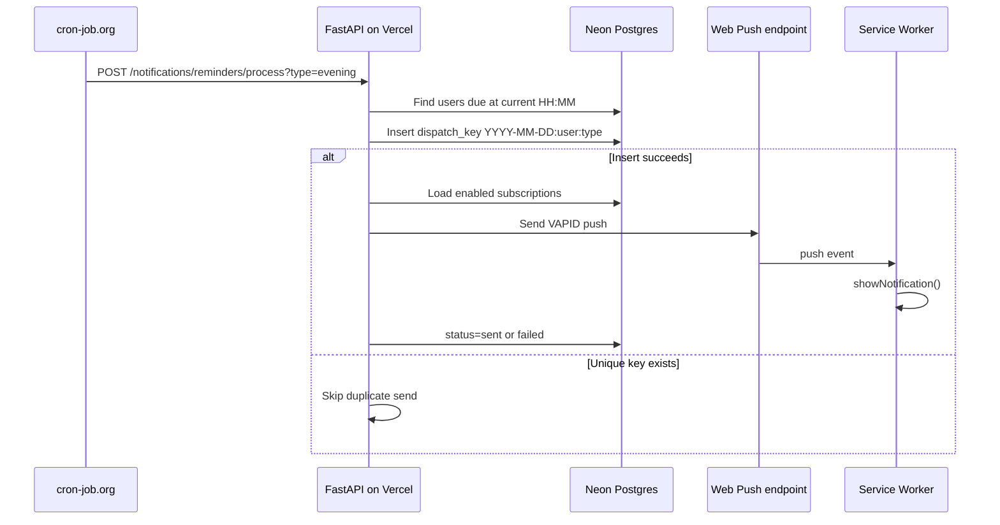

# Chef Reminders

Chef uses a lightweight reminder system designed for small PWAs with three daily nudges: morning, afternoon, and evening. It does not create task rows or reminder rows. The scheduler asks the backend to send a reminder type, and the backend sends Web Push notifications to every enabled device for users whose configured time matches the current IST minute.

## Architecture



## Data Model

`push_subscriptions` stores one row per browser push endpoint:

- `id`
- `user_id`
- `endpoint`
- `p256dh`
- `auth`
- `device_name`
- `platform`
- `enabled`
- `created_at`
- `updated_at`

`user_reminder_settings` stores the fixed schedule:

- `user_id`
- `enabled`
- `morning_time`
- `afternoon_time`
- `evening_time`
- `updated_at`

`reminder_dispatch_log` is an idempotency and audit table, not a reminder queue. It stores one unique dispatch key per user, date, and reminder type so duplicate cron calls cannot send the same notification twice.

## Runtime Flow



## API

- `GET /notifications/vapid-public-key`
- `GET /notifications/subscriptions`
- `POST /notifications/subscriptions`
- `DELETE /notifications/subscriptions`
- `GET /notifications/settings`
- `PUT /notifications/settings`
- `POST /notifications/reminders/process?type=morning|afternoon|evening`

The processing endpoint requires `X-Cron-Secret: <REMINDER_CRON_SECRET>`.

## Environment

Backend:

```bash
VAPID_PUBLIC_KEY=...
VAPID_PRIVATE_KEY=...
VAPID_SUBJECT=mailto:you@example.com
REMINDER_CRON_SECRET=long-random-secret
```

Frontend:

```bash
NEXT_PUBLIC_API_URL=https://your-chef-api.vercel.app
```

The frontend reads the public VAPID key from the backend so only the backend needs VAPID key configuration.

Generate VAPID keys locally:

```bash
python -m pywebpush --vapid
```

## cron-job.org Setup

Create three jobs:

- Morning: `POST https://your-chef-api.vercel.app/notifications/reminders/process?type=morning`
- Afternoon: `POST https://your-chef-api.vercel.app/notifications/reminders/process?type=afternoon`
- Evening: `POST https://your-chef-api.vercel.app/notifications/reminders/process?type=evening`

Add this request header to each job:

```text
X-Cron-Secret: <REMINDER_CRON_SECRET>
```

Run the jobs once per minute if reminder times are user-configurable. The endpoint only sends when the current IST `HH:MM` equals the user's configured time and the dispatch key has not already been claimed.

## Design Decisions

- Web Push plus a service worker is used so reminders can arrive when the PWA is closed.
- Browser timers are not used for delivery. The browser only subscribes or unsubscribes the device.
- Multiple devices are supported by storing every push endpoint for a user and sending to all enabled subscriptions.
- Invalid subscriptions are disabled when the push service returns `404` or `410`.
- A dispatch log prevents duplicate sends during concurrent or repeated cron calls.
- Fixed reminders avoid the operational cost of a task recurrence engine. A future task system should store recurrence rules separately and materialize only near-term reminders into a reminders table.
